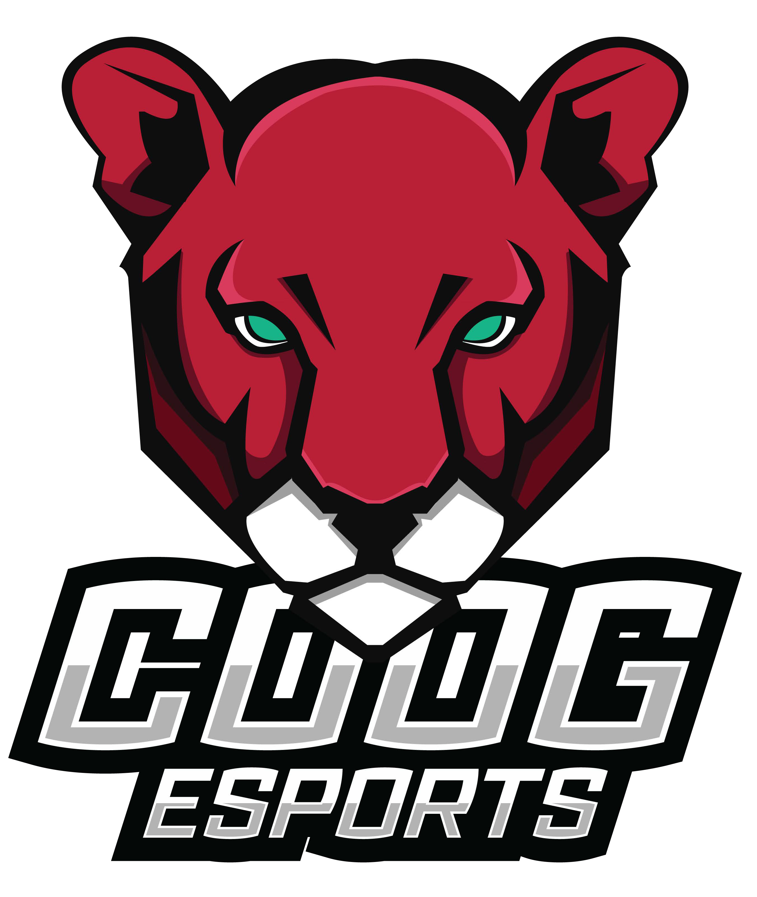

<p align="center"><a href="https://laravel.com" target="_blank"></a></p>

<p align="center">
<a href="https://github.com/laravel/framework/actions"></a>
<a href="https://packagist.org/packages/laravel/framework"></a>
</p>

## About

Coog Gaming and Esports is the largest student-run gaming organization at the University of Houston. We strive to promote the culture of casual and competitive gaming throughout the Houston area. From console to PC gaming, to board games and trading card games, we're here to share the passion that we all love: Gaming.

This is the official website of Coog Esports. This project is built with Laravel, Laravel Breeze with Blade, Laravel Cashier, and Laravel Fortify. The CSS framework used is Tailwind CSS compiled in real-time with PostCSS. Everyone and anyone is encouraged to get involved with the development of this website. 

## Requirements

This project uses the Laravel PHP framework and has a few system requirements. You should ensure that your web server or local development environment follows the minimum requirements set out in the Laravel documentation.

## Installation

As per the requirements, PHP and MySQL will be needed along with its associated software. If you're on Windows it's recommended to use something like Laragon as it provides almost everything you'll need to get started.

**Action required: It is HIGHLY recommended to use Visual Studio Code.**

Once you've completed the above steps, you can move on to installing Composer, a PHP package manager. It's recommended to use the Windows installer so it can set Composer to your PATH without much work on your part.

To clone the repository in its entirety, including the LICENSE.md file, you can use the following command in the command prompt or PowerShell on Windows, or Terminal on macOS or Linux:

```
git clone https://github.com/CoogGaming/website
```

After cloning the repository, we'll need to now use Composer to install our dependencies required by the project:
```
composer install
```

To install without development dependencies and ONLY production dependencies run:
```
composer install --no-dev
```

**Action required: Create a NEW `.env` file and copy the contents of the `.env.example` into the new file. DO NOT delete the `.env.example` file unless you're running in production.**

The project WILL NOT run without the `.env` file.

Start your MySQL server and have a database created with the password ready (if in production):
```
DB_CONNECTION=mysql
DB_HOST=localhost
DB_PORT=3306
DB_DATABASE=coogesports # set this to the database you created
DB_USERNAME=root # never use root in production
DB_PASSWORD= # set a strong password, if in production
```

Run the project's database migrations, which will create the application's database tables:
```
php artisan migrate
```

To render the application's frontend we use the Blade stack with Vite to compile the applications's frontend assets:
```
npm install
npm run dev
```

You can start a local PHP server (not meant for production) with:
```
php artisan serve
```
## Contributing

Thank you for considering contributing to the Laravel framework! The contribution guide can be found in the [Laravel documentation](https://laravel.com/docs/contributions).

## Code of Conduct

In order to ensure that the Laravel community is welcoming to all, please review and abide by the [Code of Conduct](https://laravel.com/docs/contributions#code-of-conduct).

## Security Vulnerabilities

If you discover a security vulnerability within Laravel, please send an e-mail to Rafael Galvan via [rbgalvan@uh.edu](mailto:rbgalvan@uh.edu). All security vulnerabilities will be promptly addressed.

## License

This project is open-sourced software licensed under the [MIT license](https://opensource.org/licenses/MIT).
